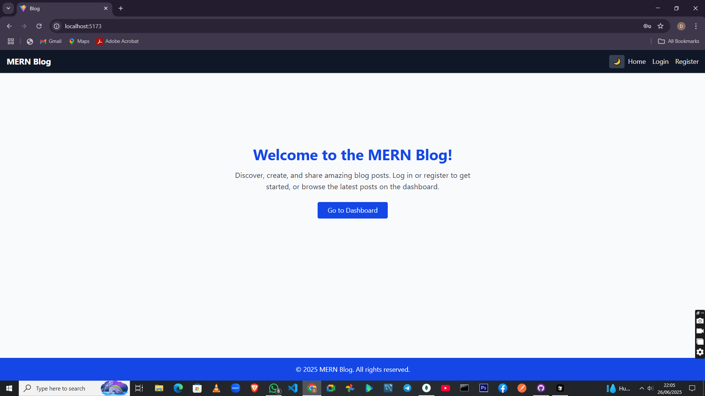
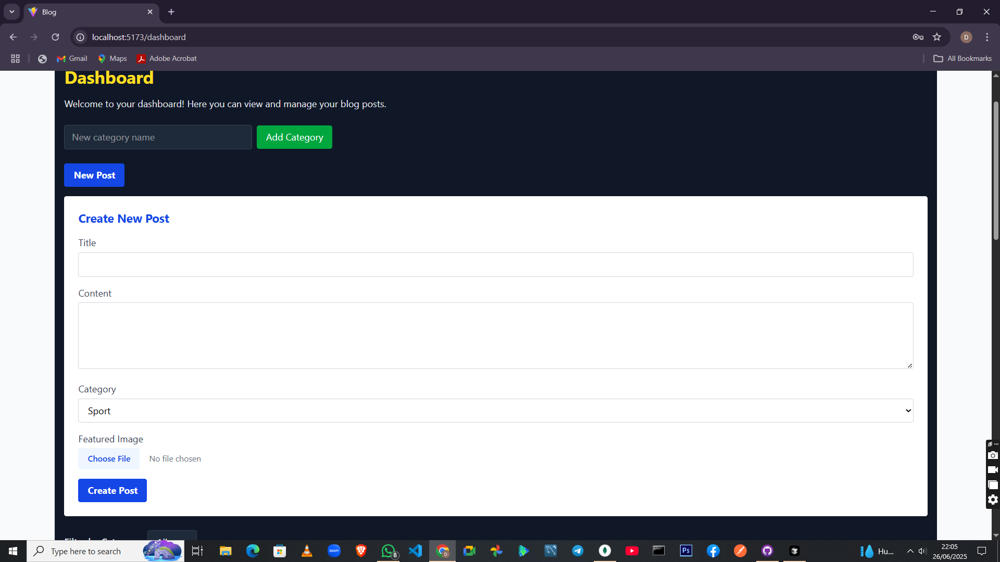

[](https://classroom.github.com/online_ide?assignment_repo_id=19850108&assignment_repo_type=AssignmentRepo)
# MERN Blog Application

A full-featured blog platform built with the MERN stack (MongoDB, Express.js, React.js, Node.js). This project demonstrates seamless integration between front-end and back-end, including authentication, image uploads, comments, pagination, search, and dark/light mode.

---

## 🚀 Features
- User authentication (JWT, registration, login, protected routes)
- Create, edit, delete, and view blog posts
- Category management and filtering
- Image uploads for blog post featured images
- Pagination and search for posts
- Comments on blog posts
- Responsive UI with dark/light mode toggle
- Optimistic UI updates and error handling

---

## 🛠️ Technologies Used

### Backend
- **Node.js** (v18+)
- **Express.js**
- **MongoDB** (with Mongoose ODM)
- **JWT** for authentication
- **bcryptjs** for password hashing
- **multer** for image uploads
- **express-validator** for input validation
- **CORS** for cross-origin requests
- **dotenv** for environment variables

### Frontend
- **React.js** (with Vite)
- **React Router DOM** for routing
- **Axios** for API calls
- **Tailwind CSS v4.0** for styling
- **React Context API** for authentication state

---

## 📂 Project Structure

```
root/
  client/           # React frontend
    src/
      components/
      pages/
      hooks/
      services/
      context/
    public/
    .env.example
    ...
  server/           # Express backend
    models/
    controllers/
    routes/
    middleware/
    config/
    uploads/
    .env.example
    ...
  README.md
```

---

## ⚙️ Backend Setup (server)

1. **Install dependencies:**
   ```sh
   cd server
   pnpm install # or npm install
   ```
2. **Set up environment variables:**
   - Copy `.env.example` to `.env` and fill in:
     ```env
     PORT=5000
     MONGODB_URI=mongodb://localhost:27017/blog
     JWT_SECRET=your_jwt_secret_here
     ```
3. **Start MongoDB** (locally or with Atlas).
4. **Run the backend server:**
   ```sh
   pnpm run dev # or npm run dev
   ```
5. **Image uploads:**
   - Ensure the `uploads/` directory exists in `server/`.
   - Images are served at `/uploads/filename.jpg`.

---

## ⚙️ Frontend Setup (client)

1. **Install dependencies:**
   ```sh
   cd client
   pnpm install # or npm install
   ```
2. **Set up environment variables:**
   - Copy `.env.example` to `.env` and fill in:
     ```env
     VITE_API_URL=http://localhost:5000/api
     ```
3. **(Optional) Set up Vite proxy for /api:**
   - In `vite.config.js`:
     ```js
     export default {
       server: {
         proxy: {
           '/api': 'http://localhost:5000',
         },
       },
     };
     ```
4. **Run the frontend dev server:**
   ```sh
   pnpm run dev # or npm run dev
   ```
5. **Open the app:**
   - Visit `http://localhost:5173` in your browser.

---

## 🌐 Usage
- Register a new user and log in.
- Create categories and posts (with images).
- Edit, delete, and search posts.
- Filter posts by category.
- Add and view comments on posts.
- Toggle dark/light mode in the navigation bar.

---

## 📝 Environment Variables

### Backend (`server/.env`)
```
PORT=5000
MONGODB_URI=mongodb://localhost:27017/blog
JWT_SECRET=your_jwt_secret_here
```

### Frontend (`client/.env`)
```
VITE_API_URL=http://localhost:5000/api
```

---

  ## 📸 Screenshots

  ### Home Page
  

  ### Dashboard (Dark Mode)
  

  

---

## 🧪 Testing
- Use Postman or the frontend UI to test all endpoints.
- Ensure MongoDB is running and accessible.

---

## 📦 Deployment
- For production, use services like Heroku, Vercel, Netlify, or your own VPS.
- Set environment variables securely in your deployment environment.
- Serve the frontend build (`client/dist`) from the backend or a static host.

---

## 🙏 Credits
- Built with the MERN stack and Tailwind CSS.
- Inspired by modern blog platforms and best practices.

---

## 📄 License
MIT 